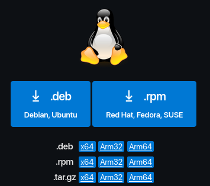
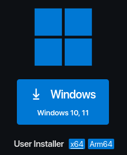
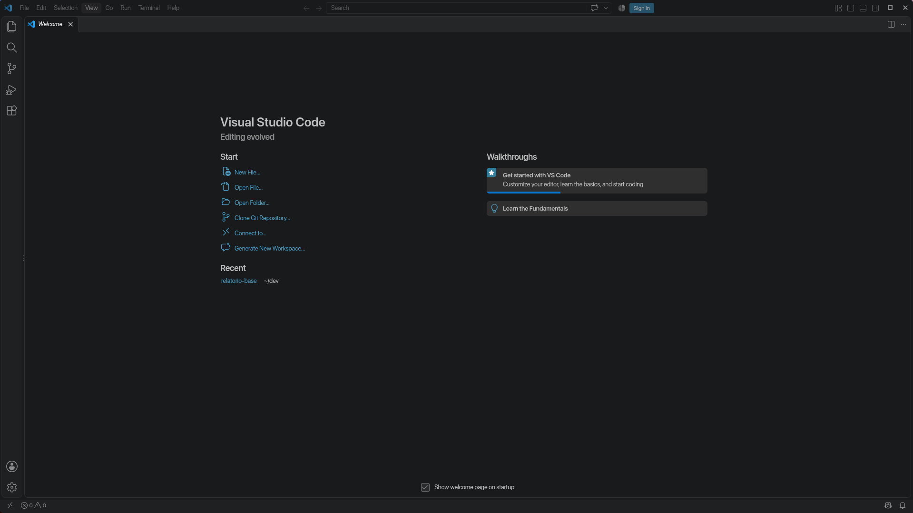
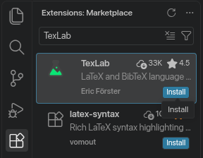
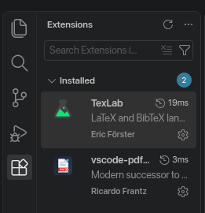
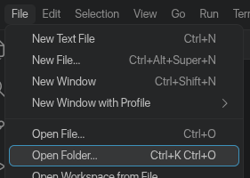
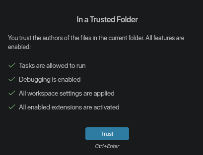
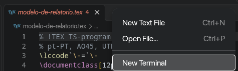
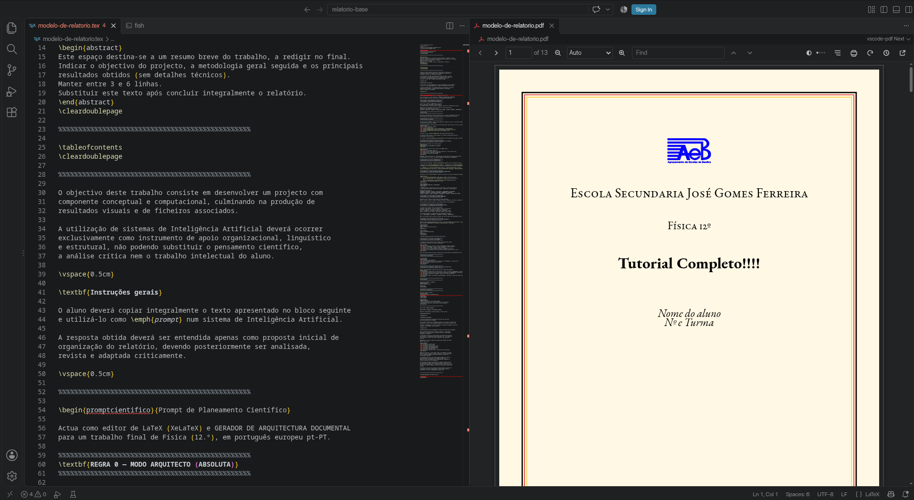

<h1 align="center">Tutorial de LaTeX com Tectonic</h1>


### 1. Fundamentos

Para escreveres relatórios sobre trabalhos que elaborarás, estão a mandar-te instalar uma coisa de que provavelmente nunca ouviste falar, chamada "Latex"<a href="#note1"><sup>1</sup></a>, porquê? *Não posso só escrever os meus relatórios no o Word ou no Google Docs?*

Teoricamente... podes. Contudo, isto não é tão boa ideia como poderás imaginar. Esta imagem explica a diferença entre estes dois tipos de aplicações bastante bem:

<p align="center"></p>

Ou seja, se tentasses escrever os relatórios num processador de texto normal (como o Word), provavelmente demorarias mais tempo, o resultado ficaria menos visualmente apelativo, e (bastante) pior formatado.

<a id="note1"></a>(*1. Estilizado como LaTeX; lê-se 'lateq', porque o X é um χ (qui) grego*)


### 2. Mas o que faz o LaTeX? Como posso fazer um documento?

O LaTeX é um programa de composição tipográfica de documentos, que funciona à base de código. Isto significa que tu escreves (melhor, *descreves*) o teu documento com comandos de formatação num ficheiro `.tex`, e executas a compilação (tradução) para PDF. Não te preocupes se nunca escreveste código! O formato em si é muito básico, os comandos são todos palavras em inglês que já deves conhecer. Não é comparavel a uma linguagem de programação 'a sério'.

Quando às funcionalidades do LaTeX, e como escrever código TeX, terás de ter em mente três aspetos:

- **Separação de conteúdo e formatação**: O utilizador concentra-se apenas no que está a escrever (parágrafos, fórmulas, etc.), enquanto o programa cuida automaticamente da tipografia e espaçamentos.

- **Fórmulas matemáticas**: É a ferramenta padrão para escrever expressões matemáticas a computador. Irrespetivamente da complexidade, ficam legíveis e em alta definição.

- **Referências automáticas**: O LaTeX fará a gestão automática das figuras (imagens) e bibliografia dos teus documentos.

Para exemplificar, incluí um documento básico em LaTeX com tudo isto:

```latex
%  O simbolo '%' faz com que tudo à sua frente na mesma linha seja ignorado pelo
%  LaTeX, usamo-lo para escrever mensagens (comentários) que explicam o nosso código
%
%  Todos os comandos começam com '\', e os que têm argumentos (opções)
%  usam chavetas '{}' como parênteses


% Todos os documentos LaTeX têm um tipo básico: artigo, livro, carta, etc.

\documentclass{article}
% |
% `-> Este é um artigo, tem Secções, mas não tem Capítulos como um livro


% O LaTeX, por si só, é bastante básico, para coisas mais complexas, carregamos Pacotes
% Cada pacote adiciona os seus próprios comandos, que facilitam certas coisas, como exemplos:

\usepackage[portuguese]{babel} % -> Suporte para várias línguas (como o português)

\usepackage[backend=biber]{biblatex} % -> Gestor de bibliografia avançado

\usepackage{xcolor}%  -> Definições de cor do documento


% Alguns exemplos de comandos:

% Do 'xcolor'
\pagecolor{black} % Fundo preto
\color{white}     % Texto branco

% Do BibLaTeX - usa o ficheiro bibliográfico .bib (será-te útil!)
\addbibresource{bibliografia.bib}


% O comando a seguir tira-nos do modo de configuração (o 'preâmbulo')
% e inicia o modo documento
\begin{document}


% O comando \section{} define uma secção
\section{Vantagens do \LaTeX}


% 'itemize' define uma lista de pontos não ordenada
\begin{itemize}

    % Cada \item define um ponto da lista
    \item Separação de conteúdo e formatação: Concentras-te apenas
    no que estás a escrever (parágrafos, fórmulas, etc.), enquanto o sistema
    cuida automaticamente da tipografia, espaçamentos, paginação.
    % |
    % `-> No PDF, não vão aparecer parágrafos aqui. Ou deixamos uma
    %     linha vazia, ou usamos o atalho '\\', como no item abaixo


    \item Fórmulas matemáticas: É a ferramenta padrão para escrever \\
    (linha exemplar) \\
    equações matemáticas complexas claramente formatas em qualidade. Por exemplo: \\

    % Para escrever matemática, usamos o cifrão ($) para denotar o seu início e fim.
    $ f(x) = \int_{-\infty}^{\infty} \sum_{n=1}^{\infty} \frac{\alpha_n}{n^2}, dx $
  % |
  % `-> Usar penas um cifrão comprime a expressão para caber na altura duma linha

    % Dois cifrões fazem com que cada símbolo ocupe a sua altura normal
    % Se estiver numa linha separada, também fica centrada
    $$ f(x) = \int_{-\infty}^{\infty} \sum_{n=1}^{\infty} \frac{\alpha_n}{n^2}, dx $$


    % Adicionamos referências com o comando '\cite{}', sendo o nome igual ao que
    % definimos no ficheiro bibliografia.bib
    \item \textbf{Referências automáticas}: Faz gestão automática de figuras e
    bibliografia. Podemos citar um livro: (\cite{livroLatex}), e este aparecerá
    nas refrências.
    % (O comando \textbf{} formata o texto para bold)

\end{itemize}


% Não te esqueças de escrever a bibliografia no final
\printbibliography

\end{document}
```


Isto resulta no [seguinte documento](imagens/demo_latex.pdf):

<p align="center">  </p>


### 3. Está bem, está bem, convenceste-me. Como é que instalo isto?

Ensinarei o meu método preferido para instalar, porque existem vários, e porque acho que há uma alternativa melhor aos métodos tradicionais, se estiveres disposto a aprender um pouco sobre como isto tudo funciona. **Aviso**: Não poderei ajudar sempre que tiveres um problema, contudo, se tiveres, muito provavelmente são por causa do *teu código* e não ao meu método de instalação. O meu método funciona com [quase](https://github.com/tectonic-typesetting/tectonic/issues/1086#issuecomment-2364793487) tudo, e se tiveres de fazer algo incompatível com ele, adicionarei uma solução neste site. 

Quanto à instalação, depende. **Se estiveres no Linux** (Manjaro ou CachyOS), (que, já agora, eu <ins>recomendo usares</ins> se estiveres disposto a fazer outro pequeno esforço), abre o teu terminal e executa o comando

```bash
sudo pacman -S tectonic biber
```

*(A quem não tem familiaridade com o uso da linha de comandos, recomendo ler este pequeno guia: <https://promovaweb.com/glossario/cli> e outros do mesmo site)*

Este comando instalará o Tectonic, que é ambos a nossa **engine** (motor) e **distribuição** de LaTeX. Uma engine é o programa que contém o sistema básico de LaTeX, usado para transformar o teu texto num PDF. A distribuição gere e instala todas as ferramentas e adicionais (bibliotecas, fontes) especificados em cada documento. O comando também instala o Biber, que age juntamente com o BibLaTeX para criar a bibliografia.

**Se estiveres no Windows**, abre o PowerShell, e cola e executa o seguinte comando:

```pwsh
md "C:\Latex" -f; [Environment]::SetEnvironmentVariable("Path", "$([Environment]::GetEnvironmentVariable("Path","User"));C:\Latex", "User")
```

Quando estiver completo, terás uma nova pasta chamada 'Latex' no teu disco C:, que podes encontrar em 'Este PC' -> Disco Local (C:).

A seguir, vai ao site <https://tectonic-typesetting.github.io/latest.html>. Na lista do fundo da página, clicka no 'tectonic...windows-msvc.zip' a azul (o número poderá ser diferente no futuro):

<p align="center">  </p>

Será transferido um arquivo `.zip`, que deverás extrair: abre o Explorador de Ficheiros, carrega com o botão direito no arquivo, e clicka em 'Extrair Tudo', ou abre como WinRAR ou 7-Zip para fazer o mesmo. Aparecerá um ficheiro chamado `tectonic.exe`, copia-o, e cola-o na pasta `C:\Latex`. Seguidamente, repete o mesmo processo:

- **Biber.** Vai a este site <https://sourceforge.net/projects/biblatex-biber/files/biblatex-biber/current/binaries/Windows/> e copia o `biber.exe` do ficheiro abaixo para a pasta `Latex`

<p align="center">  </p>

- **Python.** Neste site <https://www.python.org/downloads/windows/>, seleciona a opção 'Windows embeddable package (64-bit)' (como na imagem), e copia **tudo dentro da pasta** extraída para a pasta `Latex`.

<p align="center">  </p>


### 4. Como compilar para PDF

Agora que tens tudo instalado, estás preparado para compilar um relatório. Devido a diferenças da engine, só conseguirás compilar se tiveres umas pastas extras dentro da pasta `auxiliares`. Apenas tens de, na lista de ficheiros deste site, carregar no `relatorio-base.zip`, e descarregar o ficheiro:

<p align="center">  </p>

Extrai a pasta e copia a resultante para um lugar à tua escolha (por exemplo, `Documentos`).

#### Se estiveres no Linux (passa à frente se não)

Abre o teu terminal na pasta 'relatorio-base', e usa `ls` para verificar que lá está o teu `modelo-de-relatorio.tex`. Poderás então executar o meu *script* de compilação, que chama o Tectonic automáticamente:

```sh
python make.py modelo-de-relatorio.tex
```

Podes abreviar o comando dando permissões de execução ao script. No terminal, na mesma diretoria:

```bash
chmod +x make.py
```

A partir de então, poderás compilar apenas com `./make.py modelo-de-relatorio.tex`. E parabéns, já és capaz de escrever e compilar ficheiros LaTeX!


#### Se estiveres no Windows

No Explorador, entra na pasta 'relatorio-base' que contém o ficheiro `modelo-de-relatorio.tex`. Carrega na barra de endereço, apaga o texto, e escreve 'powershell' (ou 'powershell.exe' se não funcionar), deste modo:

<p align="center">  </p>

Isto abrirá um terminal PowerShell na pasta. Daqui, podes executar um *script* Python que escrevi para compilares mais convenientemente. Fá-lo executando este comando

```pwsh
python.exe make.py modelo-de-relatorio.tex
```

*(Nota: para repetires comando anteriores, carrega na a tecla ↑, e ↓ para voltar para os posteriores)*

O comando demorará o seu tempo a terminar. Quando deixar de escrever texto, se não houver nenhum erro, terás um ficheiro `modelo-de-relatorio.pdf` dentro da pasta, que poderás abrir e ler. Parabéns, tens uma instalação de LaTeX funcional!


### 5. Configurar um editor de documentos

Para usar o Tectonic, recomendo-te usar o editor Visual Studio Code, da Microsoft. Existem maneiras de fazer tudo no terminal, com editores como o [Helix](https://helix-editor.com/) ou [Neovim](https://neovim.io/), mas é muito complexo, então deixei apenas os links para quem se interessar.

A configuração do ambiente de edição é bastante básica: instala-se o editor, depois algumas extensões, e finalmente misturamos tudo num *layout* com tudo o que é preciso. Para instalar o editor:

#### No Linux

Vai à página de download do VSCode (<https://code.visualstudio.com/Download>) e clicka na opção 'x64' em '.tar.gz':

<p align="center">  </p>

Extrai o ficheiro descarregado, e abre o terminal na pasta extraída ('VSCode-linux-x64'). Copia, para dentro dessa pasta, o ficheiro [com.microsoft.VSCode.desktop](./com.microsoft.VSCode.desktop), que poderás descarregar diretamente do GitHub para lá. Depois, executa este comando no terminal (dentro da pasta 'VSCode...'):

```bash
bash -c 'sudo ln -s $(pwd)/bin/code /usr/local/bin/code && sudo cp resources/app/resources/linux/code.png /usr/share/icons/ && sudo cp com.microsoft.VSCode.desktop /usr/share/applications'
```

Quando terminar, o teu computador reconhecerá o VS Code como uma aplicação, que poderás abrir a partir da pesquisa, ou pelo comando `code` no terminal. Para não fechar quando quiseres fechar o teu terminal, abre normalmente pela barra de pesquisa (recomendo afixares na barra de taréfas para ser mais fácil).

#### No Windows

Dirige-te a <https://code.visualstudio.com/Download> e clicka na opção 'x64' do 'User Installer' para Windows:

<p align="center">  </p>

Isto descaregarrá um ficheiro executável. Abre-o, e segue as instruções. Quando estiver instalado, abre o programa, e afixa-o na barra de taréfas por conveniência.

#### Configuração

Fecha os pop-ups que abrirão inicialmente, e a janela do 'Chat' à direita. Terás um ecrã mais ou menos assim:

<p align="center">  </p>

A seguir, instala duas extensões: clicka no botão das quatro caixas, no canto superior esquerdo, e usa a barra de pesquisa para procurar as extensões:

- 'vscode-pdf Next'
- 'TexLab'

Tendo escrito tudo, clicka em 'Instalar', na caixa da extensão:

<p align="center">  </p>

Confirma que confias no desenvolvedor das duas extensões. No final, deverás ter uma página de extensões com esta aparência:

<p align="center">  </p>

Podes fechar a aba das extensões como a abriste. Agora, abre a pasta do relatório base pelo menu 'Ficheiro' em cima:

<p align="center">  </p>

Terás de dar permissões próprias à pasta para poderes usar as extensões. No canto inferior esquerdo, verás uma caixa colorida que diz algo como 'Modo Restringido'. Clicka na caixa, e seleciona esta opção:

<p align="center">  </p>

Podes fechar o pop-up, está quase! Agora, na barra da esquerda, clicka no ícone dos ficheiros, e, da lista, carrega com o botão esquerdo no `modelo-de-relatorio.tex`. Depois, com o botão direito, clicka no PDF, e clicka na opção de abrir ao lado. Deverá abrir o teu PDF, ou pedir para selecionares o leitor, que deve ser o vscode-pdf. Por último, clicka no espaço vazio ao lado do separador do ficheiro `.tex`, e clicka em 'Novo Terminal':

<p align="center">  </p>

Daqui, podes escrever o comando de compilacão (`python make.py ...`) e trabalhar no teu relatório. Deverás ter um editor com mais ou menos esta aparência:

<p align="center">  </p>

Parabéns, concluiste o tutorial! Abre a barra de ficheiros para editar os outros ficheiros da pasta, e lembra-te de gravar as tuas edições com `Ctrl + S`.


<br>
<br>
<h2 align="center">Extras</h2>

### CONFLITOS DO PREÂMBULO COM O TECTONIC

O Tectonic não instala fontes, apenas usa ficheiros locais. É preverível copiar a fonte para a diretoria dos auxiliares.
No preâmbulo, altere o comando `\setmainfont` de modo a incluir:
```latex
\setmainfont{EBGaramond}[ % Tudo junto, não 'EB Garamond'
  %%  %%  %%  %%  %%  %%  %%  %%  %%
  Path=./auxiliares/ebgaramond/,
  Extension=.ttf,
  UprightFont=*-Regular,
  BoldFont=*-Bold,
  ItalicFont=*-Italic,
  BoldItalicFont=*-BoldItalic,
  %%  %%  %%  %%  %%  %%  %%  %%  %%
  ...
```

Para o Biber funcionar, tem de estar instalado localmente. Contudo, o Tectonic tem conflitos de versão com o BibLaTeX do Arch. Isto pode ser aliviado se a sua localização for especificada à hora da compilação. Use a opção `-Z search-path=auxiliares/biblatex/` quando for compilar.
**AVISO**: não funciona com o BibLaTeX 3.22, pois o Tectonic ainda usa o TeX Live 2025. Use a versão 3.21 do SourceForge (presente nas pastas demo/ e auxilares/).

A opção `german` não funciona no comando `\setotherlanguages{}`. `ngerman` também não funciona.

O `pythontex` não funciona com o Tectonic porque o pacote exige a execução de comandos e scripts externos intermediários durante a compilação. Deve ser removido do preâmbulo.

O Tectonic pode escrever ficheiros log com a opção --keep-logs.
